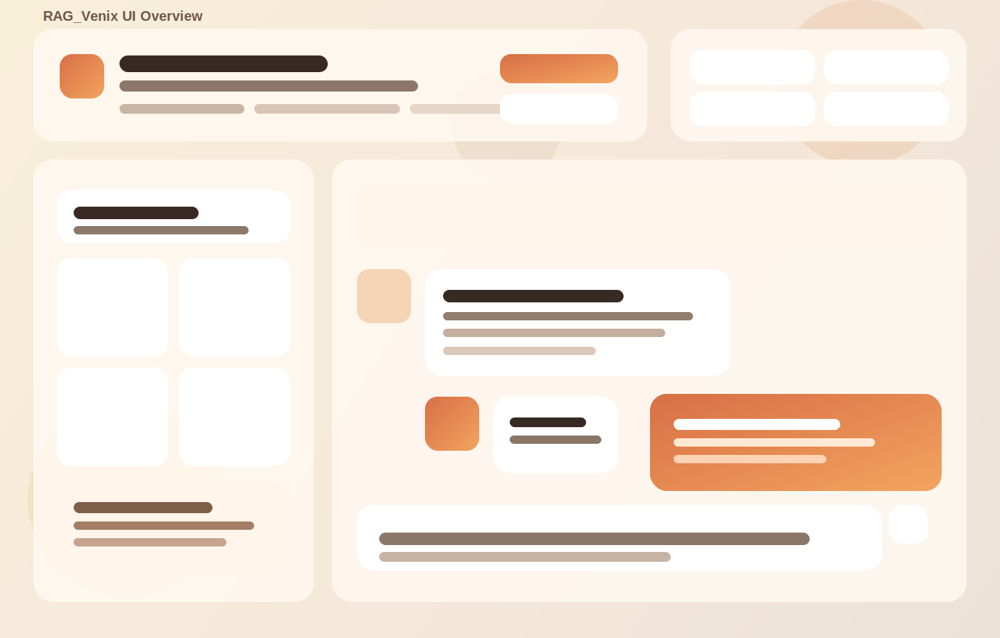
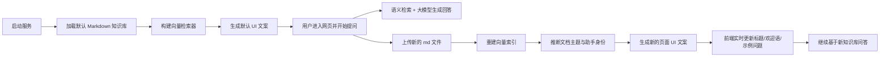

# RAG_Venix

一个基于 FastAPI + LangChain + FAISS + OpenAI 的 Markdown 知识库问答系统。  
系统支持默认知识库问答，也支持在 Web 页面中上传新的 `md` 文件并实时替换当前知识库，同时自动刷新页面标题、欢迎语、示例问题和助手身份等 UI 文案。



## 系统特点

- 支持基于 Markdown 文档构建向量知识库
- 支持默认知识库启动，无需每次重新上传文件
- 支持在网页中上传新的 `md` 文件并动态切换知识库
- 上传新知识库后，页面中的介绍文案、示例问题、助手身份会同步更新
- 支持多轮对话，保留最近若干轮聊天上下文
- 支持基础模式下的问题相关性判断，避免无关问题进入 RAG 检索
- 支持上传模式下直接进入当前文档问答流程
- 支持聊天记录导出
- 前端界面已做响应式适配，适合桌面端和移动端浏览

## 功能说明

### 1. 智能问答

系统会基于当前知识库内容进行语义检索，并结合大模型生成回答。  
默认情况下，项目内置了一份员工手册示例数据：

- [datasets/模拟公司员工手册.md](datasets/模拟公司员工手册.md)

### 2. 动态知识库切换

用户可以直接在网页顶部点击“上传并切换知识库”，选择新的 Markdown 文件。  
系统会自动完成以下动作：

1. 保存上传文件到 `uploads/`
2. 重新切分 Markdown 内容
3. 重新构建当前运行时的向量检索器
4. 推断当前文档对应的助手身份
5. 生成新的 UI 文案配置
6. 在不刷新整页逻辑的前提下更新页面内容

### 3. 动态页面文案刷新

上传新知识库后，以下页面内容会实时切换：

- 顶部主标题和副标题
- 当前文档名称
- 助手身份说明
- 欢迎区标题和描述
- 首条助手欢迎消息
- 输入框占位提示
- 快速提问示例
- 能力卡片文案

### 4. 前端交互增强

当前页面包含这些交互能力：

- 欢迎区展开 / 收起
- 快速问题一键填充
- 输入框高度自适应
- 助手消息一键复制
- 上传状态与网络状态提示
- 平滑滚动到底部
- 对话导出

## 项目结构

```text
rag_venix/
├── app.py
├── docs/
│   └── ui-overview.svg
├── static/
│   └── index.html
├── datasets/
│   └── 模拟公司员工手册.md
├── innovationtech_handbook_db/
│   ├── index.faiss
│   └── index.pkl
├── uploads/
│   └── *.md
└── README.md
```

## 运行环境

建议环境：

- Python 3.10+
- 已配置可用的 OpenAI API Key

## 安装与启动

### 1. 安装依赖

如果你还没有安装依赖，可以先执行：

```bash
pip install fastapi uvicorn python-multipart python-dotenv pydantic
pip install langchain langchain-openai langchain-community langchain-text-splitters
pip install faiss-cpu
```

### 2. 配置环境变量

在项目根目录准备 `.env` 文件：

```env
OPENAI_API_KEY=your_openai_api_key
```

### 3. 启动服务

```bash
python app.py
```

服务默认运行在：

- [http://localhost:8110](http://localhost:8110)

## 使用流程

### 方式一：直接使用默认知识库

1. 启动后端服务
2. 打开浏览器访问首页
3. 系统自动加载默认知识库
4. 在输入框中输入问题并发送
5. 查看系统返回的回答

### 方式二：上传新的 Markdown 知识库

1. 启动后端服务并打开页面
2. 点击页面右上方“上传并切换知识库”
3. 选择一个新的 `.md` 文件
4. 等待系统重建索引
5. 页面标题、欢迎语、示例问题会自动切换
6. 基于新知识库继续提问

## 一次完整操作示例

### 示例场景

假设你当前启动的是员工手册知识库，页面会展示类似：

- 助手身份：HR 助手
- 示例问题：年假、病假、绩效、福利等

此时你上传一个新的项目 SOP 文档，例如：

- `Starry_SOP.md`

上传完成后，页面会自动变化为：

- 更符合该 SOP 文档的标题和介绍
- 更贴合 SOP 的快速提问示例
- 更符合文档主题的助手身份

也就是说，页面不再固定写死为单一 HR 场景，而是会跟随当前知识库主题切换。

## 系统处理流程



## 主要接口

### `GET /`

返回前端主页。

### `POST /api/chat`

发送用户问题并返回问答结果。

请求体示例：

```json
{
  "message": "请问年假有多少天？"
}
```

### `GET /api/stats`

返回当前向量库状态、模型信息、聊天长度、当前文档名等统计信息。

### `GET /api/ui-config`

返回当前页面使用的动态 UI 配置，用于前端刷新标题、欢迎语、示例问题等内容。

### `POST /api/upload`

上传新的 Markdown 文件并切换当前知识库。

## 页面更新逻辑说明

本项目这次更新的重点不只是“上传新的文档”，而是让页面本身也跟着当前知识库变化。

具体来说：

- 后端会在默认启动和上传新文件后生成一份 UI 配置
- 前端不再把欢迎语、初始介绍、示例问题写死在 HTML 中
- 前端通过 `/api/ui-config` 和上传返回结果来更新页面内容
- 因此一个页面可以从“HR 助手”切换成“项目 SOP 助手”或其他文档主题助手

## 适用场景

- 企业制度问答
- SOP / 流程文档问答
- 内部知识库演示
- 多文档主题切换展示
- RAG 原型验证和教学展示

## 后续可继续扩展的方向

- 增加 `requirements.txt`
- 增加 `.gitignore`
- 支持上传多个文档并合并索引
- 支持显示检索片段来源
- 支持知识库切换历史
- 支持用户上传后持久化保存 FAISS 索引
- 增加真实页面截图到 `docs/` 目录

